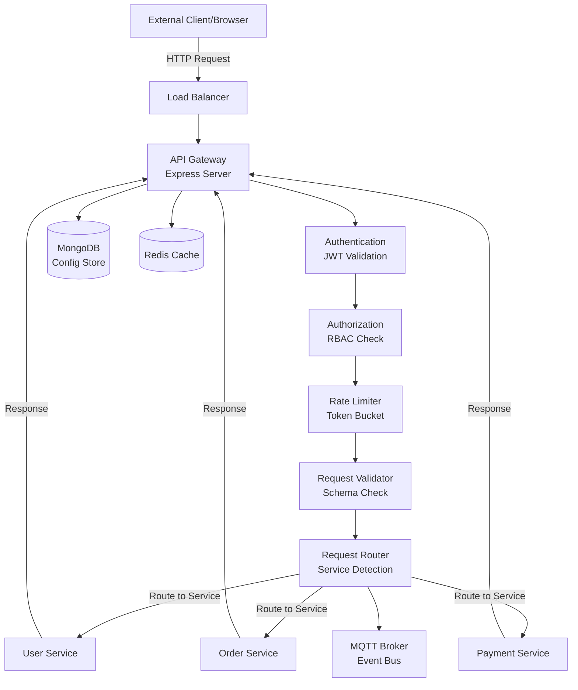

## Code Description (mandatory)

The API Gateway implements a multi-layered architecture using Node.js and Express.js. The core module initiates the HTTP server, establishes connections to MongoDB for persistent configuration storage, connects to MQTT for event messaging, and initializes Redis for caching and rate limiting.

**Main Components:**

1. **Request Router** - Routes incoming HTTP requests to appropriate backend microservices based on URL patterns and routing rules configured in MongoDB
2. **Authentication Module** - Validates JWT tokens, refreshes expired tokens, and manages user sessions using Redis
3. **Authorization Layer** - Enforces role-based access control (RBAC) and permission checks for each endpoint
4. **Rate Limiter** - Implements token bucket algorithm using Redis to prevent abuse
5. **Request Validator** - Validates incoming JSON payloads against defined schemas using Joi
6. **Response Transformer** - Normalizes responses from different microservices into consistent format
7. **MQTT Publisher** - Publishes important events to MQTT topics for asynchronous processing
8. **Logging System** - Centralized logging using Winston to file and console
9. **Error Handler** - Graceful error handling with appropriate HTTP status codes and error responses

**Main Entry Point:** `src/index.js` - Initializes the application, connects to databases, and starts the HTTP server

---

## Architecture Diagram

### Architecture Components

**API Layer:**
- Express.js server handling HTTP requests/responses
- Middleware pipeline for request processing
- RESTful endpoint definitions
- OpenAPI documentation

**Security Layer:**
- JWT token validation and refresh
- Role-Based Access Control (RBAC)
- Request signing and validation
- CORS and header protection

**Performance Layer:**
- Redis-based caching for frequently accessed data
- In-memory request rate limiting
- Connection pooling for database and MQTT
- Request/response compression

**Integration Layer:**
- Service discovery and routing to backend microservices
- MQTT publisher for event-driven architecture
- MongoDB connection for configuration management
- Redis connection for session and cache management

---

### Additional Information

**Key Design Patterns:**
- **Middleware Pipeline** - Sequential request processing through middleware
- **Circuit Breaker** - Graceful handling of failed backend services
- **Bulkhead** - Isolated connection pools per service to prevent cascading failures
- **Event-Driven** - MQTT publish for important service events
- **Cache-Aside** - Check cache before querying database

**Important Implementation Details:**
- Non-blocking I/O using Node.js async/await
- Connection reuse with MongoDB connection pooling
- Request timeout handling for upstream services (15 seconds default)
- Graceful shutdown with connection cleanup
- Health check endpoint at `/health` for load balancer

**Monitoring and Observability:**
- Request/response logging with unique correlation IDs
- Performance metrics exported to monitoring system
- Error rate tracking and alerting
- Service dependency health status monitoring

**Scaling Considerations:**
- Horizontal scaling via load balancer distribution
- Redis pub/sub for service-to-service communication in distributed setup
- Connection pooling tuned for high concurrency
- Stateless design allowing multiple instances
