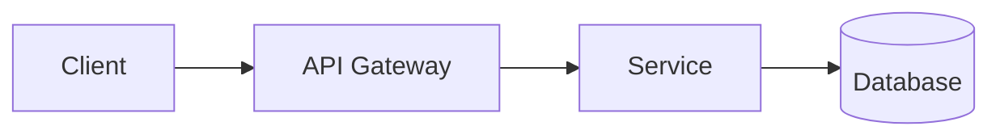

# [ID-000] Feature / Service Title

| Metadata | Details |
| --- | --- |
| **Author** | [Author Name] |
| **Created** | YYYY-MM-DD |
| **Ticket/Issue** | [Jira Issue] |

---

## 1. Summary & Context

### 1.1 Goals

- [Goal 1 - e.g., Increase conversion by X%]
- [Goal 2 - e.g., Reduce latency to Y ms]

### 1.2 Non-Goals (Out of Scope)

- [What we are explicitly NOT doing in this iteration]

---

## 2. Requirements (mandatory)

### 2.1 Requirements

- **FR-001**: System MUST [specific capability, e.g., "allow users to create accounts"]
- **FR-002**: System MUST [specific capability, e.g., "validate email addresses"]
- **FR-003**: Users MUST be able to [key interaction, e.g., "reset their password"]
- **FR-004**: System MUST [data requirement, e.g., "persist user preferences"]
- **FR-005**: System MUST [behavior, e.g., "log all security events"]

### 2.2 User Stories (Gherkin) (mandatory)

*Scenario 1: Successful interaction*

- **Given** the user is on the login page
- **When** they enter valid credentials
- **Then** they are redirected to the dashboard
- **And** a success toast is displayed

### 2.3 Acceptance Criteria (mandatory)

1. System must respond within X ms.
2. User receives an email confirmation.
3. [Other verifiable criterion].

---

## 3. Technical Design

*Core SDD Section: Define contracts before coding.*

### 3.1 Architecture / Flow Diagram

(Place for Mermaid diagram, image, or link to Figma/Excalidraw).



### 3.2 API Interface (Contract)

**Endpoint:** `METHOD /v1/path/to/resource`

**Headers:** `Authorization: Bearer <token>`

**Request Payload:**

```json
{
  "field": "type",
  "required": true
}
```

**Response Payload (200 OK):**

```json
{
  "id": "uuid",
  "status": "success"
}
```

**3.3 Data Model**
Database schema changes 

| **Table/Collection** | **Field** | **Type** | **Notes/Indexes** |
| --- | --- | --- | --- |
| `users` | `is_active` | `boolean` | New flag for soft-delete |

**3.4 Dependencies & Risks**

- **Internal:** Does this depend on Team X finishing the Auth Service?
- **External:** Are we reliant on a 3rd party API (e.g., Google Maps)?
- **Risk:** What is the rollback plan if the migration fails?

## 4. Cross-Cutting Concerns

### 4.1 Security & Permissions

- Who can access this? (Roles: Admin, User, etc.)
- Is there any PII(Personally Identifiable Information) or sensible information?

### 4.2 Observability & Metrics

- What events will be logged?
- What success metrics (KPIs) will be monitored?

### 4.3 Migration & Compatibility

- Are DB migration scripts required?
- Does this break backward compatibility (e.g., Mobile App versions)?

## **5. Edge Cases**

*Explicit definition of what happens when things go wrong or aren't ideal.*

- What happens when [boundary condition]?
- How does system handle [error scenario]?

**5.1 Error Handling**

| **Scenario** | **HTTP Code** | **Error Code/Message** | **User Feedback (UI)** |
| --- | --- | --- | --- |
| Invalid Input | 400 | `INVALID_FORMAT` | Show red border on input |
| Resource Not Found | 404 | `USER_NOT_FOUND` | Redirect to 404 page |
| Server Timeout | 504 | `GATEWAY_TIMEOUT` | Show "Try again" toast |

### **5.2 UI States**

- **Empty State:** [What does the user see if there is no data? e.g., Illustration]
- **Loading State:** [Skeleton loader vs Spinner]
- **Network Error:** [Offline mode behavior]

## **6. Testing Strategy**

*How do we verify this spec is met?*

### **6.1 Unit Tests**

- [ ]  Test validation logic for input fields.
- [ ]  Test data transformation functions.

### **6.2 Integration Tests**

- [ ]  Verify API returns 200 OK with valid database entry.
- [ ]  Verify API returns 400 Bad Request on invalid schema.

## 7. Execution Plan

Technical task breakdown.

- [ ]  Design & Spec approved
- [ ]  DB Migration script created
- [ ]  Backend Implementation